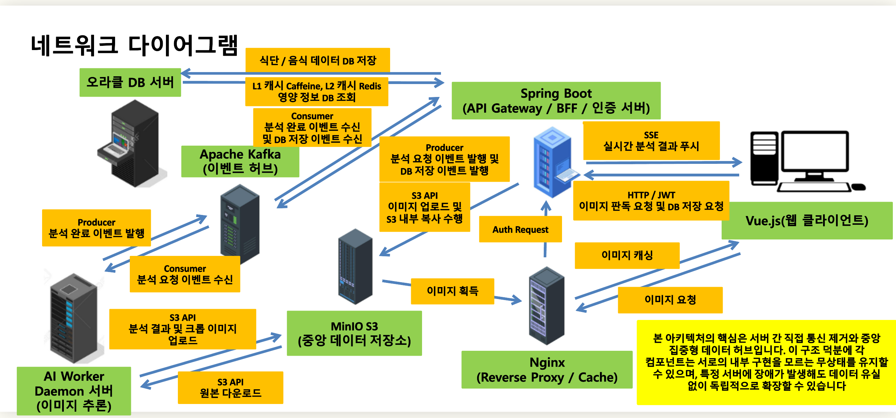

# 오늘의 식단 기록
> AI 기반 식단 이미지 분석 및 영양 정보 관리 시스템

단순한 기능 구현을 넘어, **트래픽 폭주/시스템 장애 등 극단적인 운영 환경을 가정하고 이를 방어하는 아키텍처**를 목표로 설계했습니다. 프레임워크 추상화 이면의 동작 원리를 깊이 파고들고, 하부 인프라와 네트워크 프로토콜의 특성에 맞춰 시스템을 지속적으로 개선한 결과물입니다.

---

## System Architecture
관심사 분리를 극대화하기 위해 **BFF(Backend For Frontend)** 패턴과 **이벤트 기반 아키텍처(EDA)** 를 채택했습니다. 모든 컴포넌트는 **무상태(Stateless)** 로 동작하며, 공유 저장소(S3)와 메시지 브로커(Kafka)를 통해 느슨하게 연결됩니다.

### 구성 요소

- Vue.js, 프론트엔드
- Nginx, 이미지 보안 프록시 및 캐시
- Spring Boot, BFF 겸 게이트웨이 및 인증 서버
- Oracle DB, 마스터 데이터 저장소
- Apache Kafka, 메시지 브로커 및 이벤트 허브
- Python AI 워커, 추론 데몬
- MinIO, 중앙 오브젝트 스토리지

### 네트워크 다이어그램(Data & Event Flow)


### 식단 이미지 추론 처리 흐름

1. 업로드 단계: Vue가 BFF를 통해 이미지를 MinIO에 저장하고, Kafka에 추론 요청 이벤트를 발행합니다.
2. 처리 단계: Kafka 이벤트를 수신한 AI 워커가 MinIO에서 이미지를 내려받아 추론을 수행하고 결과를 MinIO에 저장합니다.
3. 알림 단계: AI 워커가 Kafka에 추론 완료 이벤트를 발행하면, BFF가 이를 소비하여 SSE로 Vue에 실시간 푸시합니다.
4. 서빙 단계: Vue의 이미지 요청을 Nginx가 수신하고, BFF에 인증을 위임한 뒤 Nginx가 MinIO에서 이미지를 가져와 캐시하여 Vue에게 서빙합니다.

### 식단 확정 및 영구 저장 흐름

1. 저장 요청 단계: 사용자가 분석 결과 저장을 요청하면, Vue가 JWT 인증을 포함하여 Spring Boot에 전달합니다.
2. 이미지 이전 단계: Spring Boot가 MinIO 내부 복사 기능을 사용하여 임시 저장소의 이미지를 사용자 전용 영구 저장소로 이동합니다. 이 과정에서 서버를 거치지 않습니다.
3. 이벤트 발행 단계: Spring Boot가 영구 저장된 이미지 경로를 포함한 저장 이벤트를 Kafka에 발행합니다.
4. 데이터 적재 단계: Kafka 이벤트를 수신한 Spring Boot가 식단 및 영양소 매핑 데이터를 Oracle DB에 트랜잭션으로 최종 저장합니다.

### 2단계 캐시 조회 흐름

1. 1단계 캐시 조회: Spring Boot가 먼저 로컬 메모리 캐시(Caffeine)에서 영양소 정보를 검색합니다. 네트워크 통신이 발생하지 않습니다.
2. 2단계 캐시 조회: 1단계 캐시에 데이터가 없을 경우, 분산 캐시(Redis)에서 재검색합니다.
3. 데이터베이스 조회 및 캐시 적재: 두 캐시 모두 미스(Miss)가 발생한 경우에 한해 Oracle DB에서 데이터를 조회하고, 이후 요청을 위해 1단계와 2단계 캐시에 모두 적재합니다.

---

## Key Achievements & Technical Challenges

### 1. 서비스 가용성 극대화를 위한 아키텍처
*   **BFF (Backend For Frontend) 도입:** 클라이언트와 무거운 AI 서버 간의 강한 결합을 끊어내기 위해 **Spring Boot를 API Gateway 겸 BFF**로 배치했습니다. 이를 통해 각 서비스의 관심사를 분리하고 독립적인 확장성을 확보했습니다.
*   **비동기 이벤트 드리븐 파이프라인 (Kafka & SSE):** AI 추론 작업의 장기 HTTP 커넥션 점유로 인한 시스템 병목 문제를 해결했습니다. AI 연산을 **Apache Kafka** 기반의 백그라운드 워커로 분리하고, 클라이언트에게는 즉시 **202 Accepted** 응답을 반환했습니다. 이후 분석이 완료되면 **SSE**(Server-Sent Events)를 통해 결과를 실시간으로 푸시하여, 서버의 자원 고갈을 막고 심리스한 UX를 완성했습니다.
*   **Java 21 Virtual Threads 도입:** 초기에는 비동기 I/O 기반의 `WebClient`를 도입하여 성능을 검증했으나, 비동기 코드의 높은 코드 복잡도와 디버깅 비용을  확인했습니다. 이를 근본적으로 개선하기 위해 Java 21의 **가상 스레드**를 전면 도입했습니다. 동기식 코드(`RestClient`)의 직관적인 가독성을 유지하면서, I/O 대기 시 OS 스레드 낭비를 막아 비동기 방식에 준하는 대용량 처리량을 확보했습니다.

### 2. 네트워크 프로토콜 최적화 및 스토리지 제어
*   **Claim Check 패턴 적용:** 대용량 이미지 바이너리가 서버 간 네트워크를 타고 다니며 대역폭을 낭비하는 안티패턴을 해결했습니다. 이미지 본체는 **S3**(MinIO)에 저장하고, Kafka 및 서버 간에는 가벼운 **S3 Key**(참조 주소)만 공유합니다.
*   **Manual Serialization을 통한 프로토콜 한계 돌파:** 과도기 아키텍처에서, WebClient의 Chunked 전송과 수신측 WSGI 서버 간의 스펙 불일치로 데이터가 유실이 발생했습니다. 이를 프레임워크에 의존하지 않고 **RFC 7578 규격에 맞춘 수동 바이트 스트림 조립**(Manual Serialization)으로 문제를 해결하며, HTTP 프로토콜의 본질을 깊이 이해하는 계기가 되었습니다.
*   **S3 Lifecycle 및 Zero-Network Copy:** S3 내 임시 저장소(`temp/`)와 영구 저장소(`user_data/`)를 분리하고, **S3 CopyObject API**를 통해 서버의 네트워크 대역폭 소모 없이 스토리지 계층 내부에서만 데이터가 이동하도록 설계했습니다. 또한 `MinIO Client(mc)`를 활용해 임시 파일의 생명주기를 자동화했습니다.

### 3. 무상태(Stateless) 기반 보안 및 데이터 인프라 고도화
*   **Nginx `auth_request` 기반 Zero-Trust 서빙:** WAS가 무거운 정적 파일(이미지)을 직접 서빙하여 OOM(Out of Memory)이 발생하는 것을 방어했습니다. 이미지는 Private S3에 은닉하고, Nginx가 서빙과 캐싱을 전담하도록 인프라를 분리했습니다. Spring Boot는 Nginx의 요청을 받아 JWT 티켓의 유효성만 검증하는 가벼운 인가(Authorization) API를 제공하도록 설계했습니다.
*   **RTR (Refresh Token Rotation) 보안 아키텍처:** 세션을 제거하고 무상태 JWT 인증 체계를 구축했습니다. Access Token은 메모리에, Refresh Token은 HttpOnly 쿠키에 분리하여 XSS/CSRF를 방어했습니다. 나아가 Redis를 활용하여 탈취된 토큰의 재사용을 탐지하고 즉각 세션을 무효화하는 로직을 구현했습니다.
*   **2-Level Cache & Caching Invalidation:** 정적 마스터 데이터(영양소)의 반복적인 DB 조회 부하를 없애기 위해 **Caffeine**(L1)과 **Redis**(L2)를 결합했습니다. 서버 기동 시 `Cache Warming`으로 초기 지연을 제거하고, 데이터 변경 시 **Kafka를 통해 모든 서버의 로컬 캐시를 비우는 전파(Broadcasting)** 로직을 설계하여 분산 환경의 데이터 정합성을 유지했습니다.

---

## 검증 및 실증 분석
설계한 아키텍처가 실제 극한 상황에서도 유효함을 시뮬레이션과 지표를 통해 검증했습니다.

### [Test 1] k6 대규모 트래픽 부하 테스트
- **테스트 시나리오:** 10,000명의 가상 유저가 0.1초 내에 동시 접속하는 상황을 `k6`로 시뮬레이션했습니다.
- **관찰 결과:**
  1) 전통적인 Tomcat 스레드 풀(200개) 환경에서는 스레드가 즉시 고갈되며 응답 지연이 발생했고, OS 포트 고갈로 인한 `TCP RST` 에러를 로그로 직접 확인했습니다.
  2) 가상 스레드 환경에서는 컨텍스트 스위칭 오버헤드 없이 I/O 대기를 효율적으로 처리하며, 동일한 요청을 병목 없이 모두 수용했습니다.
- **결론:** 인프라 설정과 스레드 모델 튜닝이 결합되었을 때, 대규모 트래픽 상황에서도 시스템이 안정적인 서빙 능력을 유지함을 데이터로 검증했습니다.

---

### [Test 2] 데이터 정합성 및 동시성 제어 테스트
- **테스트 시나리오:** 100명의 사용자가 0.05초 간격으로 동일한 자원(계좌)에 접근하여 동시에 출금을 시도하는 경쟁 상태(Race Condition)를 재현했습니다.
- **문제 상황:** 락(Lock)이 없는 환경에서 다중 스레드의 동시 접근으로 갱신 손실(Lost Update)이 발생하여, 100번의 출금 후에도 잔액이 0원이 되지 않는 오류를 확인했습니다.
- **해결 및 튜닝:** Redis 분산 락(Redisson)을 도입하여 임계 영역을 원자적으로 보호했습니다. 이후 무한 대기로 인한 스레드 점유 장애를 방지하기 위해 Lock의 Wait Time을 조정하여, 데이터 정합성 보장과 시스템 유량 제어 사이의 균형을 확보했습니다.
- **결론:** 100번의 동시 트랜잭션 수행 후 잔액이 정확히 0원에 수렴하는 100% 데이터 정합성을 검증했습니다.

---

### [Test 3] 1.6TB 대용량 데이터 I/O 최적화
- **문제 상황:** 845,000장의 고화질 이미지 전처리 과정에서 단일 HDD의 IOPS 물리적 한계로 인해 극심한 학습 지연이 발생했습니다.
- **최적화 방법:** 물리 드라이브(SSD 1개, HDD 2개)를 분산 배치하고, YOLO Data Loader의 순차 읽기 패턴을 분석하여 파일 경로를 **교차 배열**하도록 전처리 파이프라인을 개선했습니다.
- **결론:** 디스크 I/O를 완전히 병렬화하여 하드웨어 대역폭을 극대화한 결과, 전체 처리 속도를 기존 대비 **300% 이상 향상**시켰습니다.

---

### [Test 4] Cold Start 현상 분석 및 Warm-up 전략 설계
- **문제 상황**: 시스템 초기 기동 후 첫 번째 식단 이미지 판독 요청 시, 평균 응답 시간(100ms 내외)을 크게 초과하는 약 3 ~ 5 초의 지연이 발생하는 Cold Start 현상을 관찰했습니다.
- **원인 분석**: 인프라 모니터링 및 로그 분석을 통해 지연의 근본 원인을 세 가지로 파악했습니다.
  1) Spring Boot의 최초 S3 연결 시 발생하는 TCP 커넥션 풀 초기화 비용
  2) 개발 편의를 위해 켜둔 Kafka의 `auto.create.topics.enable` 설정에 의한 런타임 토픽 생성 및 파티션 메타데이터 동기화 지연
  3) Python AI 워커의 첫 `model.predict()` 호출 시 발생하는 PyTorch 모델 가중치 메모리 적재 및 CUDA 초기화 비용
- **향후 개선 방향**: 위 지연 요소들은 프로덕션 환경에서 사용자 경험에 직접적인 영향을 미칩니다. 서버 기동 스크립트(Startup Hook) 단계에서 더미 이미지를 활용한 E2E 요청을 강제 발생시키는 Warm-up 파이프라인을 구축하여, 실제 사용자의 첫 요청부터 일관된 응답 속도를 보장하도록 개선할 계획입니다.

---

## 기술 스택

- 백엔드 및 아키텍처: Java 21, Spring Boot 3.5.12, Spring Security 6, JPA (Hibernate), MapStruct
- 인프라 및 메시지 큐: Nginx, MinIO (S3 API), Apache Kafka, Docker
- AI 워커: Python 3.12, YOLOv8 (Object Detection), OpenCV
- 프론트엔드: Vue.js 3, Axios, SweetAlert2
- 데이터베이스 및 캐시: Oracle 11g, Redis, Caffeine Cache
- 테스트 및 모니터링: k6 (부하 테스트), SLF4J MDC (분산 추적)

---

## Prerequisites & How to Run

본 프로젝트는 **Java 21 가상 스레드**, **Kafka 메시지 브로커**, **MinIO 객체 스토리지**, **Nginx 리버스 프록시** 등 실제 마이크로서비스 환경을 로컬 시스템에 최적화하여 구현했습니다. 원활한 구동을 위해 아래 순서대로 환경 구축을 권장합니다.

### 1. 개발 환경 기본 도구 설치
시스템의 핵심 엔진과 컨테이너 인프라를 위해 아래 도구들이 필요합니다.
- **JDK 21:** Eclipse Temurin 21 (LTS) 설치를 권장합니다.(가상 스레드 활용 필수 조건)
- **Docker Desktop:** 인프라 컨테이너(Kafka, MinIO, Nginx, Redis) 통합 구동용
- **Python 3.12:** AI 워커 데몬 실행용
- **Node.js:** Vue.js 프론트엔드 구동용
- **MinIO Client (mc):** 스토리지 정책 설정을 위해 mc툴(mc.exe)이 필요합니다.

### 2. 인프라 서비스 구동 (Docker)
최상위 폴더의 `docker/` 경로에서 메시지 브로커, 스토리지, 웹 서버, 인메모리 캐시를 일괄 구동합니다.
> `docker-compose -f docker/docker-compose.yml up -d`
* **Nginx:** 포트 80 (서비스 진입점 및 이미지 캐싱)
* **MinIO:** 포트 9000 (API), 9001 (Console)
* **Kafka:** 포트 9092 (이벤트 허브)
* **Redis:** 포트 6379 (분산 락 및 JWT 세션 관리)

### 3. 데이터베이스 및 스토리지 초기 설정
서비스 구동 전, 데이터 무결성과 보안 정책을 적용해야 합니다.

**A. Database(Oracle 11g 이상)**
- `database/init_database.sql` 스크립트를 실행하여 테이블 스키마 생성 및 400여 개의 영양소 마스터 데이터를 적재합니다.

**B. Storage (MinIO) 정책 적용**
- 브라우저로 `http://localhost:9001` 접속 후 `food-ai-bucket` 버킷을 생성합니다.
- `mc` 툴을 사용하여 제공된 JSON 파일 기반의 **보안 및 관리 정책**을 적용합니다.
```bash
# 1. Nginx 내부망 IP 화이트리스트 정책 적용(Zero Trust 보안)
mc.exe admin policy create myminio allow-nginx-only minio/allow-nginx.json
mc.exe anonymous set-json minio/allow-nginx.json myminio/food-ai-bucket

# 2. 임시 파일 자동 삭제 생명주기 정책 적용(비용 및 용량 최적화)
mc.exe ilm import myminio/food-ai-bucket < minio/expiry.json
```

### 4. Application 실행

**A. AI Worker (Python Inference Daemon)**
- AI 워커 전용 폴더로 이동하여 의존성 설치 후 데몬을 실행합니다.
```bash
cd backend-ai-worker
pip install -r requirements.txt
python food_ai_worker.py
```

**B. Backend (Spring Boot BFF)**
- `application.yml`의 DB 접속 정보 및 S3/Kafka 엔드포인트를 확인합니다.
- 가상 스레드가 활성화된 상태(`spring.threads.virtual.enabled=true`)로 어플리케이션을 실행합니다. (Port: 8082)

**C. Frontend (Vue.js)**
- 클라이언트 서버를 기동합니다.
```bash
cd frontend-vue
npm install
npm run serve
```
- 브라우저에서 `http://localhost:8081` 접속 후 테스트를 진행합니다.

---

### 성능 및 동시성 검증 (k6)
설계된 아키텍처의 성능과 정합성을 직접 검증할 수 있는 테스트 시나리오를 제공합니다.
(k6 설치: https://k6.io/docs/get-started/installation/)

**1. 대규모 트래픽 대응 테스트 (Virtual Threads vs OS Threads)**
- 10,000명의 동시 접속 상황에서 가상 스레드가 시스템 멈춤 없이 요청을 수용하는지 확인합니다.(에러 발생 시 load-test.js의 IP 설정 확인 필요)
> `k6 run k6-test/load-test.js`

**2. 분산 환경 동시성 제어 테스트 (Lost Update 방어)**
- 100명의 유저가 0.01초 간격으로 동시 출금 시, Redis 분산 락이 데이터 정합성을 유지하는지 검증합니다.
- 테스트 전 초기 잔액 10,000원 세팅: `curl http://localhost:8082/api/bank/reset`
> `k6 run k6-test/bank-test.js`